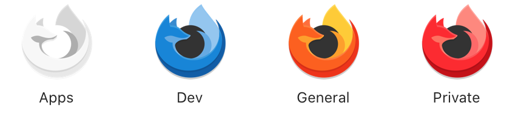
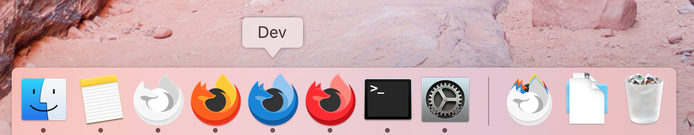

# About

Using Firefox with multiple profiles can be cumbersome even with apps like `MultiFirefox`.
For profiles which are used often it can be handy to have a dedicated way to launch the profile which looks like a native application with 1) its own name 2) its own dock icon 3) an easily identifiable icon.

This is accomplished by wrapping `run.sh`, a shell script to launch Firefox with your profile of choice, in a simple MacOS app bundle.
A set of custom colored icons from [here](https://www.reddit.com/r/firefox/comments/i0ncu4/colorfox_extended_icons_pack/) are provided.

# How To Use
## Set the Profile
Edit `Contents/MacOS/run.sh` and set `PROFILE_NAME` to the desired profile name.

## Set the Icon
Edit the value of the `CFBundleIconFile` key in `Contents/Info.plist` to specify one of the icons in `Contents/Resources`.

### Using a Custom Icon
If you want to use a custom icon you will need to create an iconset.

To turn a 256x256 png into an inconset
1) Create a directory called `ICON_NAME.iconset`
2) Place a png of dimensions 256x256 into the iconset directory and name it `icon_256x256.png`
3) Run `iconutil -c icns ICON_NAME.iconset` to create the iconset file `ICON_NAME.icns`
4) Place `ICON_NAME.icns` in `Contents/Resources`

You can then update `Info.plist` to use `ICON_NAME` as the app icon.

